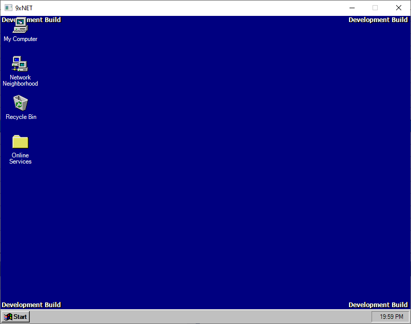

# Welcome to the 9xNET Project
[![alt text][1.1]][1]
[![alt text][2.1]][2]
[![alt text][3.1]][3]

## _Bring the classic Windows experience, without virtualization_ <br/> <br />

<br /> <a href="https://www.microsoft.com/store/productId/9N88C7Z1FL73">

</a>

<br /> 

9xNET is an open-source user interface implementation of Windows 95, written entirely in .NET

Despite the project being at early stages, I thought it would be great to share my latest work.
<!-- - Type some Markdown on the left
- See HTML in the right
- ✨Magic ✨ -->

<br />

## Connect with us!

<a href="https://discord.gg/VvtQeNKD5S"></a>


## Privacy Policy

The product does NOT collect nor track nor link any user data. It only utilizes external dynamic-link libraries (DLLs) or executable (EXEs) file(s) that are provided within the Microsoft™ Windows™ installation media to provide an authentic classic Windows experience.

## Current Features

- Context menus
- Draggable icons (still buggy)
- Start menu (incomplete)
- Rectangle selection

## History

The project (formerly codenamed "Eternal95") was started in April 2019, but had a short lifespan due to commitment problems. It was eventually branded "Dolly 95" to reflect a popular story about a cloned sheep called [Dolly](https://dolly.roslin.ed.ac.uk/facts/the-life-of-dolly/index.html).

[](https://www.youtube.com/embed/HtwIQbT6LjY "Video Title")

<!-- As [John Gruber] writes on the [Markdown site][df1] -->

> Early versions of Dolly 95 binaries are only available upon request. 


## Contributor(s)

The 9xNET project contributor(s):

- [Ahmad N. Chatila] - author of the project

## Legal notice

9xNET does NOT include any single Microsoft™ Windows™ resource file within the source code. I shall not be held responsible for including such proprietary files.

## Installation

<!-- > Before beginning, make sure to mount or insert a legitimate copy of Microsoft Windows 95 CD-ROM. Without the CD-ROM, 9xNET could not run. -->

9xNET requires a legitimate copy of [Microsoft Windows 95](https://archive.org/details/Win95OSR2) to run.

<br>

1. Insert installation media

> If you have the ISO file, please mount it. Otherwise, insert the CD-ROM and make sure that the volume is readable by the operating system.  

<br>

1. Download and install .NET 6.0 SDK for Windows

> https://dotnet.microsoft.com/en-us/download

<br>

3. Run the project

> Navigate to the source root directory using Command Prompt or Powershell and type the following:

```sh
cd src
cd W9xNET.WinCom
dotnet run --configuration Release
```

**Enjoy testing my latest work!**


[//]: # (These are reference links used in the body of this note and get stripped out when the markdown processor does its job. There is no need to format nicely because it shouldn't be seen. Thanks SO - http://stackoverflow.com/questions/4823468/store-comments-in-markdown-syntax)

[Ahmad N. Chatila]: <https://github.com/chatilaah>
[1.1]: /docs/images/iconfinder/twitter/twitter_logo.png (twitter icon with padding)
[2.1]: /docs/images/iconfinder/fb/fb_logo.png (facebook icon with padding)
[3.1]: /docs/images/iconfinder/ig/ig_logo.png (facebook icon with padding)

[1]: http://www.twitter.com/9xnetproject
[2]: http://www.facebook.com/9xnet
[3]: http://www.instagram.com/9xnet